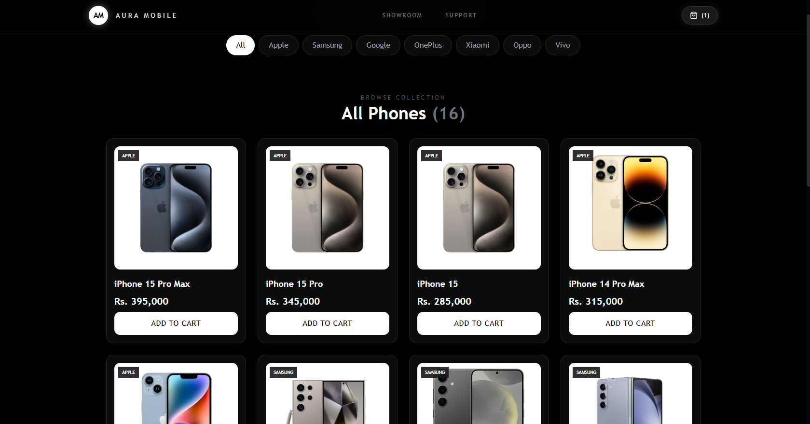
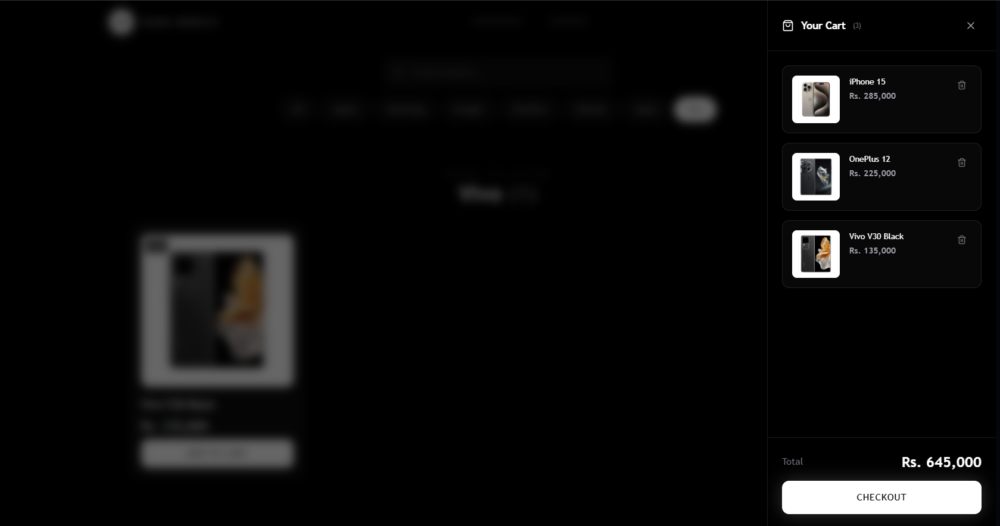

# Aura Mobile - Premium Store Experience

[](https://youtu.be/GeUN1Rq2k_A)

> **A cutting-edge, immersive web experience for high-end mobile devices.**

Aura Mobile is a premium e-commerce landing page designed to showcase the latest in mobile technology. It focuses on visual excellence, smooth performance, and interactive 3D elements to create a truly high-end digital showroom.

## Project Vision

The goal of Aura Mobile is to push the boundaries of traditional web-based shopping. By integrating real-time 3D rendering and professional-grade animations, we provide users with a tactile feel of the products before they even hold them.

---

## Key Features

### Interactive 3D Showroom
Powered by **Three.js** and **React Three Fiber**, users can rotate, zoom, and explore high-fidelity mobile device models in real-time. This immersive experience bridges the gap between digital and physical browsing.


### Cinematic Animations
Utilizing **GSAP** for scroll-triggered cinematic sequences and **Framer Motion** for micro-interactions, the interface feels alive and responsive to every user action.

### Premium UI/UX Design
- **Glassmorphism**: Sleek, frosted-glass effects for a modern aesthetic.
- **Custom Interactive Cursor**: A dynamic cursor that reacts to interactive elements, enhancing engagement.
- **Smart Preloader**: A polished entry sequence that ensures all assets are ready for a seamless experience.
- **Responsive Layout**: Tailored for all screen sizes, maintaining its premium feel from desktop to mobile.

### Integrated Shopping Experience
- **Cart System**: A sleek, accessible sidebar for managing selections.
- **Brand Integration**: A dynamic marquee and dedicated "Brand Vault" to showcase industry partners.


---

## Technology Stack

| Category | Technologies |
| :--- | :--- |
| **Core** | React 19, Vite, React Router 7 |
| **3D Engine** | Three.js, React Three Fiber, @react-three/drei |
| **Animation** | GSAP, Framer Motion |
| **Styling** | Tailwind CSS 4, Vanilla CSS, Lucide Icons |
| **UI Components** | Swiper (Sliders), Custom Hooks |

---

## Project Structure

```text
src/
├── components/          # Reusable UI elements (Hero, Navbar, Phone, etc.)
├── pages/               # Main view components (Showroom, FaceOff, Support)
├── assets/              # Static files (Images, 3D models)
├── App.jsx              # Main application logic and routing
└── index.css            # Global styles and Tailwind imports
```

---

## Getting Started

### Prerequisites
- Node.js (v18.0.0 or higher)
- npm or yarn

### Installation

1. **Clone the repository**
   ```bash
   git clone https://github.com/adeshasur/Aura-Mobile.git
   cd Aura-Mobile
   ```

2. **Install dependencies**
   ```bash
   npm install
   ```

3. **Run the development server**
   ```bash
   npm run dev
   ```

4. **Open in browser**
   Navigate to `http://localhost:5173` to see the magic.

---

Built with by [Adheesha Sooriyaarachchi](https://github.com/adeshasur)
